Our team, [Team Providence](https://www.puzzles.wiki/wiki/Team_Providence) (this year named The Providence Bureau of Invest-Egg-Ations), won the MIT Mystery Hunt! Yay, that means we get to write next year's hunt (which will be lots of work, but also a unique experience!). Incidentally, this post is part of the [April Cools](https://www.aprilcools.club/) blog series for 2026.

Now, I'm not sure many of these words actually make sense to most of my readers yet, so this post is all about what puzzle hunts are, which ones I've been involved with, and my experience with the MIT Mystery Hunt in particular.

## What are Puzzle hunts?

Even if you've heard the term before, puzzle hunts can be hard to define. I'm not going to write in *too* much detail about this because there's already an often-cited, excellent [blog post](https://blog.vero.site/post/puzzlehunts) floating around on the Internet on what they are. It's great; go read it. But in short, a puzzle hunt is a (usually) team-based competition where teams race to solve several *puzzles*. A puzzle can consist of any kind of information (for example, they may take the form of crosswords, cryptics, or sudokus, or less conventional media like song lyrics, barcodes, spectrograms, or blog posts). Any medium that can hypothetically encode information is fair game. The objective of each puzzle is to decode the information that the puzzle writer has encoded, extracting a one-word or one-phrase answer. 

What does a real puzzle look like? Here's a concrete example with [a link](https://web.archive.org/web/20200323231634/https://researchers.ms.unimelb.edu.au/~mums/puzzlehunt/2015/puzzles/4.1_Significant_Information.pdf) to one of my favorite puzzles and the one that's most memorable to me (from the 2015 MUMS Puzzle Hunt, a hunt that's run by a [student club at Melbourne University](https://umsu.unimelb.edu.au/buddy-up/clubs/clubs-listing/join/mums/). This hunt was Star Wars themed). The solution is [here](https://web.archive.org/web/20200323231700/https://researchers.ms.unimelb.edu.au/~mums/puzzlehunt/2015/answers.html?puzzle=4.1), but so you don't have to click another Wayback machine link, the steps are:
- Convert each measurement in the text to the corresponding [standard SI unit](https://en.wikipedia.org/wiki/International_System_of_Units). Notice they're the numbers 1 through 25.
- Notice that after each measurement, the next word is capitalized. Sort these words by the numbers 1 through 25, reading the first letters to get JOIN THE DOTS FOR SI BASE UNITS. 
- Play connect the dots! Go in order, but only connect dots for those that share the same units. When you do, you'll see what looks like an iron:

<div class="image-wrapper" style="display: flex; justify-content: space-evenly; align-items: flex-end;">
  
</div>

Of course, the answer is IRON. How does one go about solving puzzles? Grossly simplifying the process: look for patterns (like noticing the capitalized letters), just try things (we were given some pretty obscure units, probably a good idea to convert those), and sometimes make weird leaps in logic (though I don't think this one had any of those). The more you do these, the more you recognize certain mechanics that puzzle writers will use (sorting and indexing, for example, are *very* common). There are also blog posts out there on [how to write](https://blog.evanchen.cc/2021/02/18/some-puzzle-writing-thoughts-from-an-amateur/) [a good puzzle](https://www.mit.edu/~dwilson/puzzles/puzzlewriting.html) if you want further perspective on what these look like from a puzzle writer's eyes.

## Who am I to write about this topic?

Rest assured, I'm not the savviest of puzzle solvers and definitely not as involved with the community as some of my friends and others that I know, but I *have* been doing these for a while now. I discovered puzzle hunts when I was in my second year of the CS PhD program at Brown, looking for friends and things to do with my free time. My first hunt was the [2014 MUMS Puzzle Hunt](https://web.archive.org/web/20200417101712/https://researchers.ms.unimelb.edu.au/~mums/puzzlehunt/2014/). The puzzle-solving aspects (looking for weird patterns) and collaborative nature of these things got me really interested in them.

Dozens of hunts later, I've done quite a few (there's [evidence](https://2019.galacticpuzzlehunt.com/teams/teams%3Fteam=Brunonian%20Brain%20Nouns.html) of this online). Hunts I've done include: [SUMS Puzzle Hunts](https://www.puzzles.wiki/wiki/SUMS_Puzzle_Hunt), [MUMS Puzzle Hunts](https://www.puzzles.wiki/wiki/MUMS_Puzzle_Hunt), [Microsoft's College Puzzle Challenge](https://web.archive.org/web/20210121134922/https://www.collegepuzzlechallenge.com/) (whose [url](http://www.collegepuzzlechallenge.com/) today redirects to their careers page), [BAPHL](https://www.baphl.org/) (Boston Area Puzzle Hunt League) hunts, [DASH](https://playdash.org/) [Galactic Puzzle Hunts](https://www.puzzles.wiki/wiki/MUMS_Puzzle_Hunt), and [Palantir's Puzzle, She Wrote](https://www.puzzles.wiki/wiki/Palantir_Puzzle_Hunt), though I'm probably missing some I've forgotten about.

<div style="display: flex; justify-content: space-between; gap: 1rem;">
  <figure style="width: 32%; margin: 0;">
    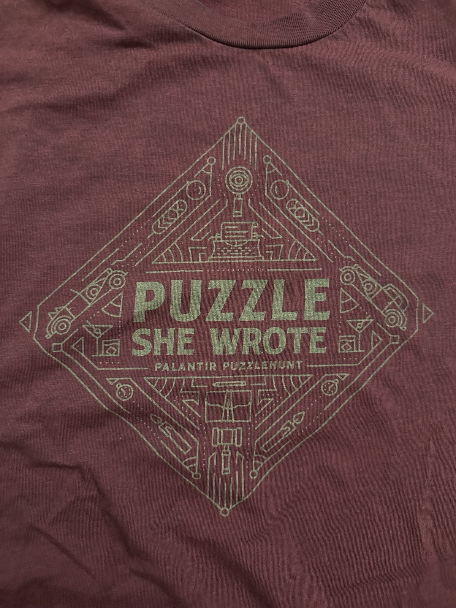
    <figcaption>Palantir's shirt (not a puzzle)</figcaption>
  </figure>
  <figure style="width: 32%; margin: 0;">
    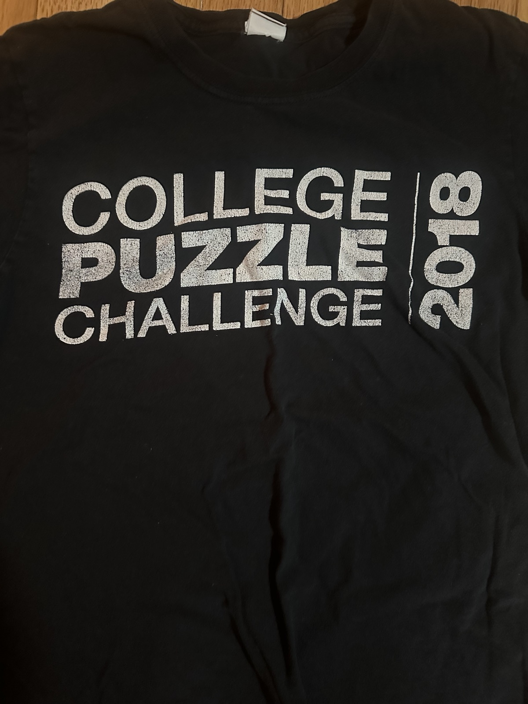
    <figcaption>CPC's shirt (front)</figcaption>
  </figure>
  <figure style="width: 32%; margin: 0;">
    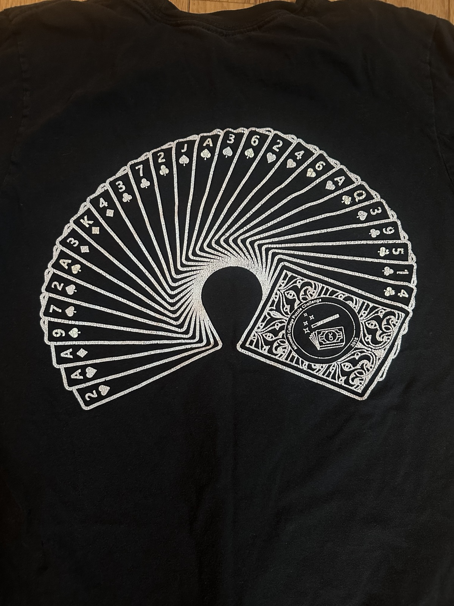
    <figcaption>CPC's shirt (back, a puzzle and glow-in-the-dark)</figcaption>
  </figure>
</div>

Standout among these was the College Puzzle Challenge, my favorite series. BAPHL was different in that it had you exploring some part of the Boston area while solving puzzles; DASH was like BAPHL but (as the name suggests) took place in multiple cities simultaneously. These three all took place in person, though many hunts (especially today in the post-COVID era) happen completely online.

One of my other involvements was with the Brown Puzzle Club (and I am technically still an admin for their original Facebook group). A friend and I had built a website ([source code](https://github.com/justinpombrio/PuzzleHunt-PH)) to host the first iteration of the CRUMS Puzzle Hunt (though it was admittedly brittle; this was my first foray into web development); the [second iteration](https://crumspuzzlehunt.com/) ran in 2020 and is still available online (these puzzles are [cited by Scale AI's blog post](https://scale.com/leaderboard/enigma_eval) on an AI-puzzle-solving benchmark). The Brown Puzzle Club still exists [today](https://brownpuzzle.club/), is much more active, and has even started running their [own hunts](https://www.brownpuzzlehunt.com/info), a couple of which I have done. It was from last year's hunt I learned for the first time, during the hunt, that (unsurprisingly) CMU has [their own puzzle club](https://puzzlehunt.club.cc.cmu.edu/) that runs their own hunt, and coordinated with Brown's to write [this very clever puzzle](https://2025.brownpuzzlehunt.com/puzzle/plagiarism) that's solvable in two different ways.

Little did I know my friends in the computer science department were paying attention to my interest in puzzles. Entirely independently, Brown CS has a tradition of dressing up a rubber chicken to represent the interests of the PhD candidate defending their dissertation... so naturally, my friends made a puzzle out of mine. You can read about this tradition [here](https://cs.brown.edu/degrees/doctoral/rubber-chickens/) (and this page exists because of me, but that's a separate story that you can ask me about).

<div class="image-wrapper" style="display: flex; justify-content: space-evenly; align-items: flex-end;">
  
</div>

Due to being busy with a kid now, my level of involvement with puzzles is mainly with going to [Puzzled Pint](https://puzzledpint.org/) regularly with a few local friends. These puzzles are extremely casual and not very competitive.

Inevitably, any discussion of puzzle hunts leads to the [MIT Mystery Hunt](https://puzzles.mit.edu/).

## The MIT Mystery Hunt

Established in 1981, the MIT Mystery Hunt is the big one and probably the most well-known and influential among them. You can go to its [Wikipedia page](https://en.wikipedia.org/wiki/MIT_Mystery_Hunt) to read a more comprehensive history. I have heard that the Hunt itself was inspired by the events and culture of the [National Puzzlers' League](https://www.puzzlers.org/) (NPL), an organization that's been around since 1883(!!), but I haven't found any good citations on this connection and so to me remains as (very credible and believable) folklore. There's this interesting fact about the NPL from its [Wikipedia page](https://en.wikipedia.org/wiki/National_Puzzlers%27_League) worth quoting:

> During World War II, the Signal Intelligence Service recruited several NPL members as government cryptographers based on their puzzling experience.

Roots of the NSA trace back to the Signal Intelligence Service, today which does its own internal puzzle thing called the [Daily Puzz](https://www.nsa.gov/puzzles/).

Since 2015 I've been part of [Team Providence](https://www.puzzles.wiki/wiki/Team_Providence), so this year's was my 12th Hunt (the year is 2026). The team was founded in 2011 by a few graduate students in the math department at Brown, and had consisted of people affiliated with Brown in some way. Since then, the team has expanded a lot, mainly through word of mouth by friends inviting other friends to join the fun. By Hunt standards, it is an unusually large team, with at least 120 people in recent years. Our Discord server (created in 2022 to coordinate during the pandemic) has over 250 users. Some our most experience members have been doing this for 20+ years. Our team used to be named The Providence Transplantations every year until 2021, when the state of Rhode Island [changed its official name](https://governor.ri.gov/executive-orders/executive-order-20-48). We've since been changing its name to something silly each year (as stated earlier, this year being The Providence Bureau of Invest-Egg-Ations).

<div class="image-wrapper" style="display: flex; justify-content: space-evenly; align-items: flex-end;">
  
</div>

Competing in the Hunt means committing to 2-3 days of solving, depending on how fast the winning team reaches the final objective. The final objective is to find the "[coin](https://puzzles.mit.edu/coingallery.html)" somewhere on MIT campus, whose location is revealed one way or another by solving the final puzzle. And this hunt runs non-stop over these days, meaning there is very much an incentive to have some members of the team awake even overnight. In fact, you need an overnight cohort if you want to be competitive. I stayed up some nights in the earlier years, but these days I do not have the energy. 

As it started, this team was just a bunch of friends getting together for some wholesome nerdery each year. We were (and still are) doing it for the fun of it, but the team as a whole got better with each year, both on at individual level and also with team coordination (efficiently distributing labor across 150 people is a massive logistical operation and warrants its own blog post). To my recollection, we finished for the first time in 2023, placing 7th, which was a surprise to us. The following years (2024 and 2025), we placed 2nd each time, and this year we actually won. The prize for winning a Hunt is writing the next year's Hunt.

<div style="display: flex; justify-content: space-between; gap: 1rem;">
  <figure style="width: 49%; margin: 0;">
    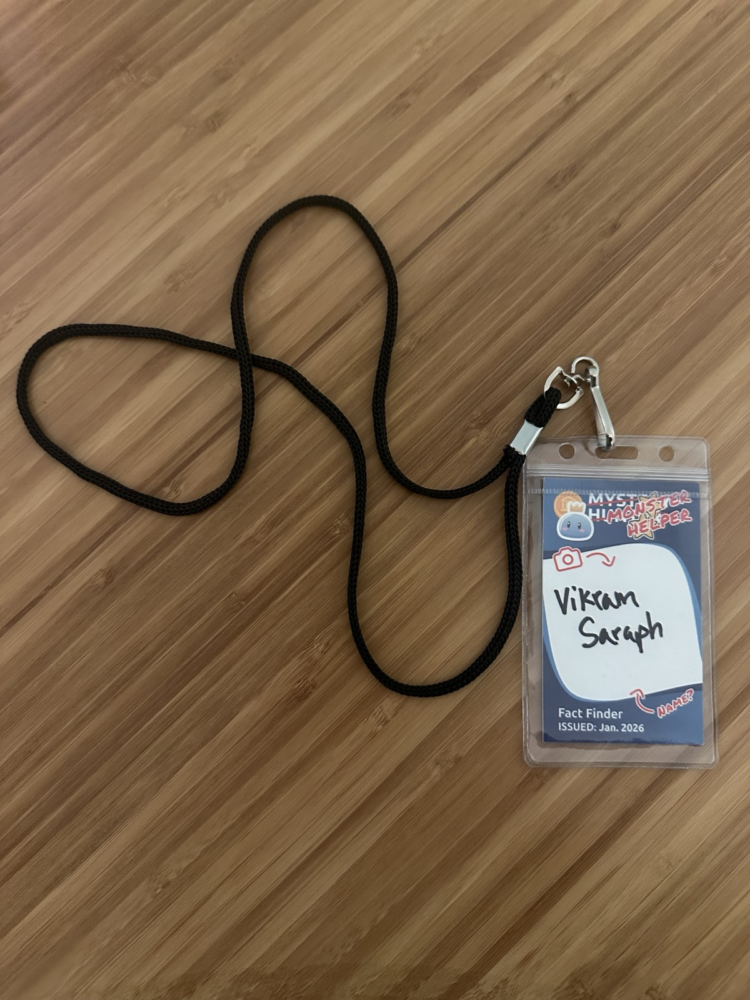
    <figcaption>This year's participant badge.</figcaption>
  </figure>
  <figure style="width: 49%; margin: 0;">
    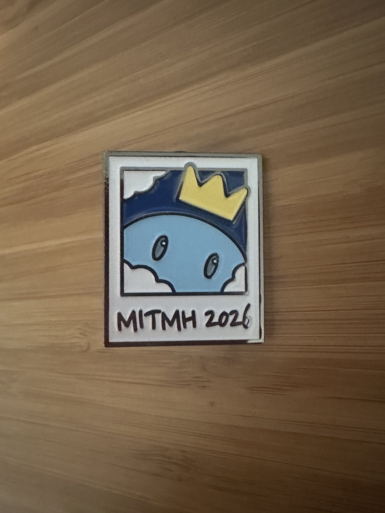
    <figcaption>Pins they were handing out roughly halfway through.</figcaption>
  </figure>
</div>


Like I'd mentioned before, I am not nearly as involved as the most intense folks on our team; I typically spend 6-8 hours per day of the hunt before going and doing other things in the Boston area (I love to travel and so it's a great reason to see other friends in the area), and this year that was less because we took our kid with us. But nevertheless there were some puzzles I helped solve and interesting things I learned along the way. I'm only going to pick a couple of puzzles I spent the most attention on.

### 2026 Hunt

Lore is an important part of the puzzle hunt experience: hunts usually have an accompanying story or theme to spice things up. The Hunt kicks off with a [skit](https://youtu.be/nC8vCTHuFxk?si=YqiUIMKLwuChZ2eU&t=472) in which the writing team describes to the competing teams the world in which they find themselves (for those of you who watch the video, it's a funny coincidence that the skit and our team name are both egg-themed). This year's, it was the world of Puzzmon, a Pokémon-inspired world. Most puzzles are hosted on a hunt website. (with some exceptions of physical puzzles handed out onsite). It was on [puzzmon.world](https://puzzmon.world/) this year; here's a screenshot from one of the website's pages:

<div class="image-wrapper" style="display: flex; justify-content: space-evenly; align-items: flex-end;">
  
</div>

Included among the puzzles I looked at were these three: [Method to the Mathmess](https://puzzmon.world/static/puzzles/assets/3f8e48ec0c1ee007.pdf), [The Alphabet](https://puzzmon.world/puzzles/7182), and [Not a QR Code](https://puzzmon.world/puzzles/9350). I'll outline bits and pieces of what I learned during each of these puzzles, though not necessarily giving a full solution, but the Hunt's archived website does have comprehensive solutions if you want to go poking around there.

### Method to the Mathmess

This is the first time I'm embedding a PDF as an [iframe](https://developer.mozilla.org/en-US/docs/Web/HTML/Reference/Elements/iframe) in a blog post. Neat that it's so easy to do:

<iframe src="mathmess.pdf" width="100%" height="500px" style="border: none;">
  <p>Your browser does not support PDFs. <a href="document.pdf">Download the PDF</a>.</p>
</iframe>

As seen above, we've got several lines of math symbols, with some obvious patterns. For example, the seven, comma, and integral symbols all appear like they have upper and lower limits. The second half of the lines all start with the number eight. We see that the digits zero through eight all appear, but not nine.

Some folks who worked on this puzzle pretty quickly (and correctly) guessed that these were a set of equations (or inequalities), but with the set of symbols that make up these equations permuted in some way. That is, a [substitution cipher](https://en.wikipedia.org/wiki/Substitution_cipher) was applied to the equations' symbols. So the puzzle would then be to figure out what the cipher is, and then use the cipher to decode the equations. One point of discussion of the presence of a comma, to which I mentioned that commas are used to separate elements of a vector (or arguments to a function with multiple arguments).

So here's what they look like decoded:

<div class="image-wrapper" style="display: flex; justify-content: space-evenly; align-items: flex-end;">
  
</div>

Each of the first six lines are just there to give you more information about substitution cipher. Evaluating the remaining eight lines, then converting each number (which falls in the range 1-26) to a letter gives us the answer: SPECIFIC.

### Not a QR Code

Most of my time onsite was spent on this one. The full text (and name) of the puzzle isn't visible until you progress far enough into the Hunt, so I'll include the full puzzle here:

<div class="image-wrapper" style="display: flex; justify-content: space-evenly; align-items: flex-end;">
  
</div>

> Design Notes
> - finder/fixed patterns included
> - no format info
> - simple mask
> - 238 bits, including error correction
> - no zigzag encoding order
> - encoded info (136 bits) is a common barcode
> - eight letter answer

Before doing anything, notice there's actually quite a bit of information here to get started and try some things. The first thing you should do is read all about how QR codes work. If you go to the [Wikipedia page on QR codes](https://en.wikipedia.org/wiki/QR_code), you'll see how information encoded in a QR code is in a zigzag fashion. Someone on our team also found [this informative graphic](https://cdn.prod.website-files.com/5f493c28a3dde53ac5e21dd2/5f5fab59893e59a951487476_how_qr_codes_work.jpg). The puzzle's text is telling us *not* to do that, so the next thing to try is by reading bits left to right, which we did.

Lost are some bits because they're obscured by the pencil overlaid on the grid. We use Hamming error correction codes to fill in the missing bits. Before doing this, as the puzzle text suggest, we need to apply a mask pattern to the bits before decoding. As shown [here](https://en.wikipedia.org/wiki/QR_code#/media/File:QR_Format_Information.svg), QR codes encode what mask pattern to apply. We can assume that the missing bits are just 0s then correct them after.

Yes, and now on to error correction. The ratio between 238 and 136, which is 7:4, is a clue to use Hamming(7, 4) error correction. For some period of time, those of us working on this puzzle were thinking of using Reed-Solomon error correction instead (via the [Galois Python package](https://mhostetter.github.io/galois/latest/api/galois.ReedSolomon/) that I learned about), but that is not correct. It was a reasonable guess though since there is a (7, 4) variant of Reed-Solomon codes.

Lastly, after repairing the incorrect bits, we need to somehow interpret this as a barcode. We'd been stuck for some time trying to use [PDF417](https://en.wikipedia.org/wiki/PDF417), a barcode format, but all we needed was [UPC](https://en.wikipedia.org/wiki/Universal_Product_Code) instead. I can't recall whether we successfully used an actual barcode reading app for the final answer, but I know someone on our team attempted it. The last step is to turn the numbers you get into letters, the answer being BASILISK.

### The Alphabet

One more [puzzle](https://puzzmon.world/puzzles/7182) that isn't entirely visible until you progress more. It is a metapuzzle, meaning that we need to use the answers of all associated puzzles, or "feeders" (as the community names them) to solve the metapuzzle. There are 26 feeder puzzles, and this is the text included with the puzzle:

> Rewrite L-system to depth five.

Very likely we should be using an L-system. [L-systems](https://en.wikipedia.org/wiki/L-system) are a formal grammar often used to generate fractals. Apparently they're using to model the growth of certain plants. They consist of an alphabet and a sequence of production rules on that alphabet. One of the simplest ones, taken straight from its Wikipedia page, is given below:

```
variables : A B
constants : none
axiom  : A
rules  : (A → AB), (B → A)
which produces:

n = 0 : A
n = 1 : AB
n = 2 : ABA
n = 3 : ABAAB
```

Each feeder answer gives us exactly one production rule for an L-system, with the full English alphabet being the L-system's alphabet. You can confirm this by starting with each letter A-Z, and applying the L-system 5 times to each letter, and counting the length of each expanded string. You will get the number sequence given to you in the puzzle:

> 10677, 21314, 24544, 20815, 9085, 13182, 22202, 14193, 10465, 14298, 17265, 22617, 21246, 20341, 15609, 21383, 17960, 30810, 23231, 15482, 20081, 11668, 25004, 20345, 21229, 19095

Reading all the feeder answers more carefully, you can see they're all of the form `L...T`, `R...T`, `F...D`, `B...K`, suggesting "LefT", "RighT", "ForwarD", and "BacK". Given the grid, this should clue you to use [Turtle graphics](https://en.wikipedia.org/wiki/Turtle_graphics) as in the [Logo programming language](https://en.wikipedia.org/wiki/Logo_(programming_language)) (my first programming language!). So we can draw out 26 different paths on the grid.

Somewhere around this time I'd left campus for the day, but the next step (as given in the solution) is to notice that each traces path bounds a region on the grid whose area is exactly the answer of the starting string. From there, you extract a single letter. The final answer is a cute, thematic IT'S LETTERTLES ALL THE WAY DOWN.

*Countless* puzzles remain that I did not get a chance to look at, so I'll leave it at this.

### The Runaround

Apparently I'd stayed on campus long enough until we solved the final metapuzzle and reached the runaround. It had us passing through [MIT's underground tunnels](https://www.youtube.com/watch?v=pCUYXYauJg0), where we had to use an AR mobile app (that I cannot recall the name of) on some of the murals on the walls to solve a puzzle. My phone had too poor a reception for the download to complete before reaching the tunnels, though among the (probably) 60+ people down there, there were way more than necessary to solve the puzzlw. I took some pictures of the murals that I really liked while down there:

<figure>
  <div style="display: flex; justify-content: space-between; gap: 1rem;">
    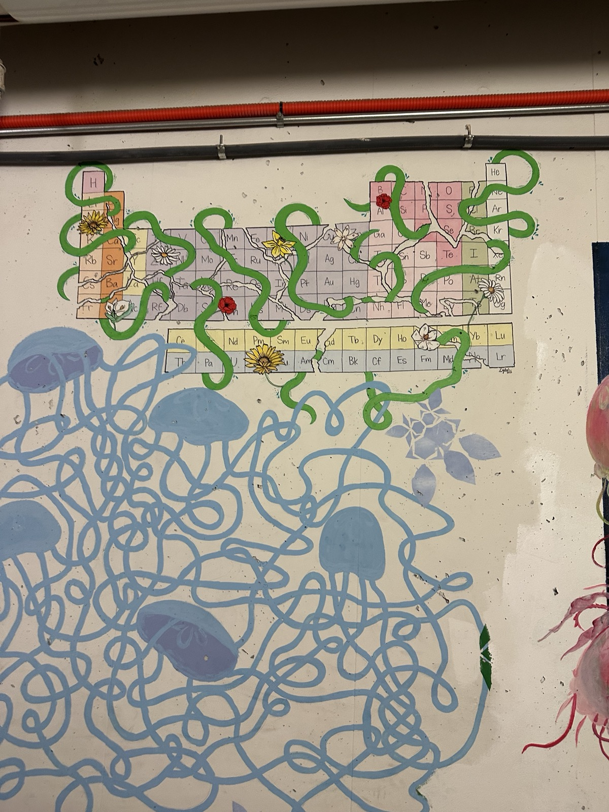
    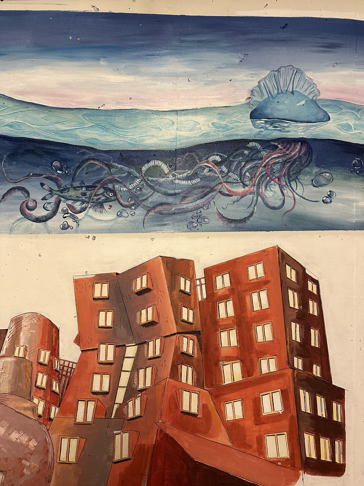
    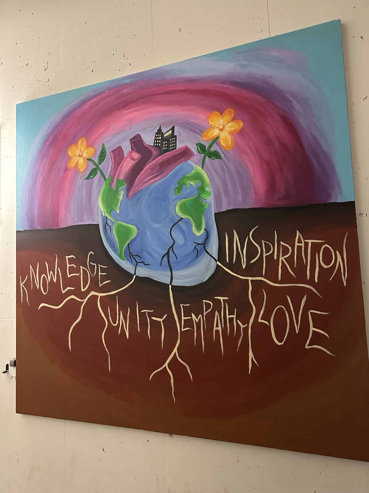
  </div>
  <figcaption style="text-align: center; margin-top: 0.5rem;">
    Some murals seen in MIT's underground tunnels.
  </figcaption>
</figure>

Live footage exists if you're curious what this looked like in person [here](https://youtu.be/sVa2W2wEohU?si=ihczRFvhCP5hQsUh&t=97); Cardinality (the organizing team) shared a [few videos on YouTube](https://www.youtube.com/@MITMysteryHunt2026) with some hunt highlights. Solving this one took us to another room where we solved the final runaround puzzle (also visible in the same video). It involved small [Gashapon-style vending machines](https://en.wikipedia.org/wiki/Gashapon) containing pieces of a physical puzzle which I helped assemble. The final answer was COINDECRYPTOOOLOGY which was also cutely thematic. I also learned of the word [oology](https://en.wikipedia.org/wiki/Oology) which is a real word.

<div style="display: flex; justify-content: space-between; gap: 1rem;">
  <figure style="width: 49%; margin: 0;">
    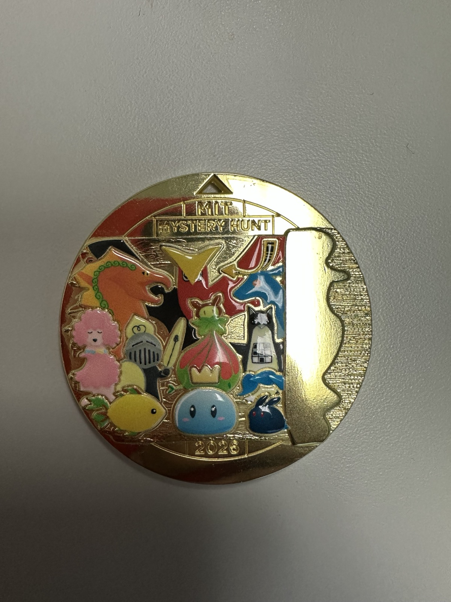
    <figcaption>Front of the coin.</figcaption>
  </figure>
  <figure style="width: 49%; margin: 0;">
    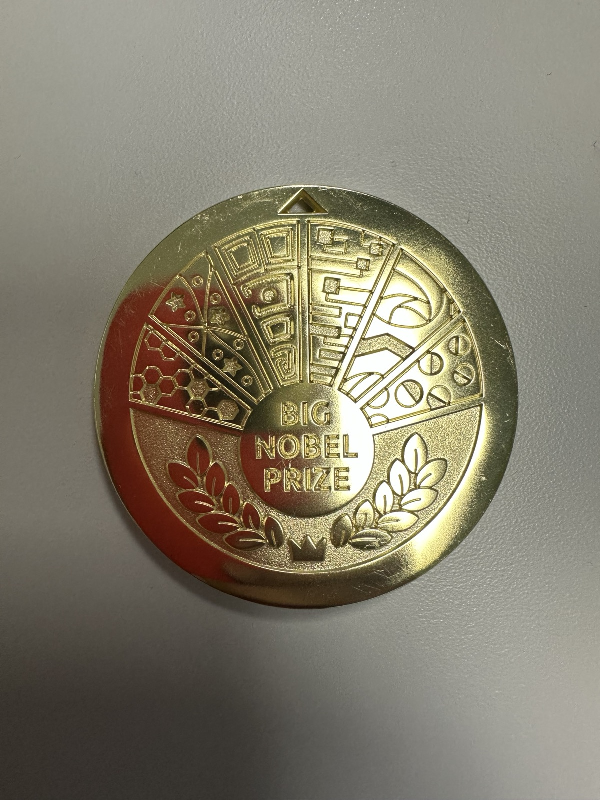
    <figcaption>Back of the coin (is a puzzle).</figcaption>
  </figure>
</div>

Lots more fun facts are available on the archived Hunt website [wrap-up page](https://puzzmon.world/wrapup?tab=summary), including some interesting statistics like how 5000+ people participated in the Hunt in person.

### Other online writing about the 2026 Hunt

It seems that writing about the MIT Mystery Hunt online has gotten really popular. Dan Katz writes about the Hunt each year; here's [his 2026 post](https://puzzlvaria.wordpress.com/2026/01/19/2026-mit-mystery-hunt/). Here are a few other posts about Hunt experiences I found online: [1](https://www.ericberlin.com/2026/01/20/little-monsters-everywhere-the-2026-mit-mystery-hunt/) [2](https://blog.cjquines.com/post/mystery-hunt-2026/) [3](https://www.alexirpan.com/2026/01/29/mh-2026.html) [4](https://www.oreateai.com/blog/beyond-the-redacted-pages-a-deep-dive-into-the-2026-mit-mystery-hunt/1aebd08dd7f1b383024ca889e2834347) [5](https://devjoe.appspot.com/hunt26/index.html) [6](https://puzzledrifter.com/mit-mystery-hunt-2026/) [7](https://fortenf.org/e/2026/01/24/mystery-hunt-2026.html) [8](https://www.dawsondo.net/puzzle/2026/01/28/mystery-hunt-2026-recap.html). I wasn't expecting to see _so_ many posts about this Hunt but it's great that there are so many.

The writing team, Cardinality, did an [AMA on Reddit](https://www.reddit.com/r/mysteryhunt/comments/1qm4hue/ama_we_are_the_members_of_cardinality_the_writing/) about the hunt they ran this year.

## What else?

Fun is the most simple way of describing puzzle hunts. I've heard of them described as "escape rooms, but on the Internet". I've only done a handful of unserious [CTFs](https://en.wikipedia.org/wiki/Capture_the_flag_(cybersecurity)) online, but I see a lot of similarities between puzzle hunts and CTFs. I think there's a lot of overlap in the mindset it takes to approach one versus the other. [DEF CON](https://defcon.org/) (the hacker conference) for example [seems](https://github.com/Professor-plum/DefCon26_Badge_Solution) to have different types of puzzles. [EFF](https://www.eff.org/) each year apparently unveils a [limited edition](https://www.eff.org/deeplinks/2014/08/effs-defcon-22-t-shirt-puzzle-explained) [t-shirt](https://www.eff.org/deeplinks/2015/08/effs-def-con-23-t-shirt-puzzle-crypto-noir) [at DEF CON](https://www.eff.org/deeplinks/2018/10/effs-def-con-26-t-shirt-puzzle) [with an](https://www.eff.org/deeplinks/2022/09/effs-def-con-30-puzzle-solved) [encoded puzzle](https://mastodon.social/@eff/114984089254639341).

As I suggested earlier, us winning the Hunt means we write next year's hunt. That's the prize for winning. This involves not just writing puzzles, but designing an overarching plot and theme, coming up with the art, having a stable, working website to host it all on, and logistics planning with the MIT puzzle club, among other tasks that I'm probably leaving out. It's a lot of work to undertake, but I'm not going to say much more about it. OPSEC is critical when designing a hunt of this kind of importance and visibility, so we've got to be careful about what's said online (for example, I learned that I was responsible for spreading a rumor that our team size was 170+ people, oops. We're large, but not that large).

There's no denying that being on a team that won the MIT Mystery Hunt is really cool. We've got such a diverse group of folks, including software engineers in tech, philosophy professors, math teachers, college students, graduate students, professional crossword designers, staff at national labs, artists, and so on. The team is so big that I definitely do not knowing everyone on it anymore, but it's been nice to be part of a team that's so inclusive in having new folks join and doing puzzle hunts just for the fun of it. Regardless of whether we won it or not. But we won!

Ending this post with a picture of merch I got from the Hunt. Also, would it be characteristic of me to hide a puzzle somewhere in this post? Maybe. <span style="color: #DDEEFF">Keep scrolling down (and/or look at the page source).</span>

<div style="display: flex; justify-content: space-between; gap: 1rem;">
  <figure style="width: 49%; margin: 0;">
    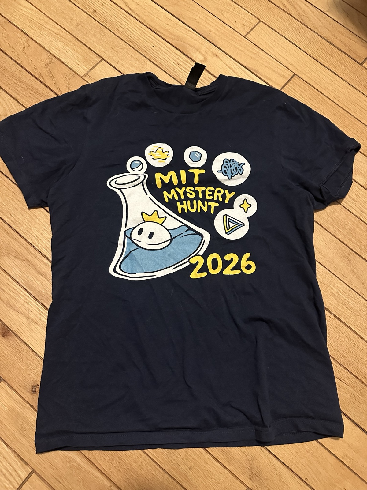
    <figcaption>Front of shirt.</figcaption>
  </figure>
  <figure style="width: 49%; margin: 0;">
    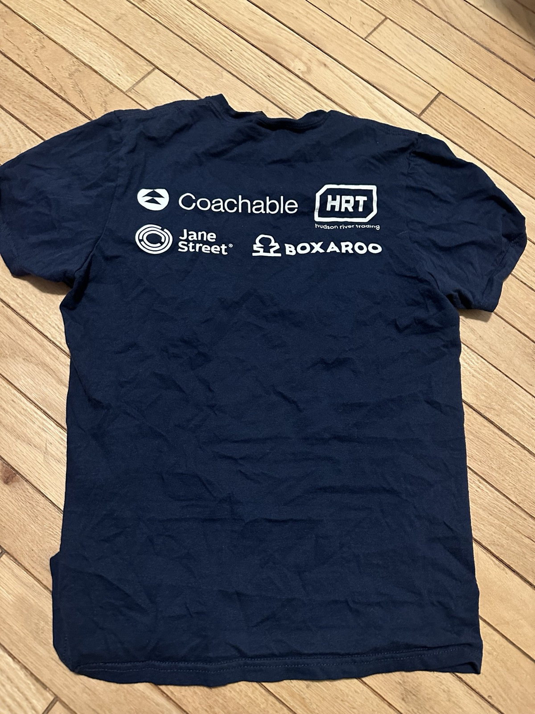
    <figcaption>Back of shirt.</figcaption>
  </figure>
</div>

<span style="color: #DDEEFF">*Initially*, you think each paragraph alone hides a secret. Individually they do not, but together, they do. You can try a rainbow table with this hash to confirm your answer: b8a201afe114d8d6e7b9fb56dd3a3ad6fc33a96fda253ba13b0281aa29c1002f </span>